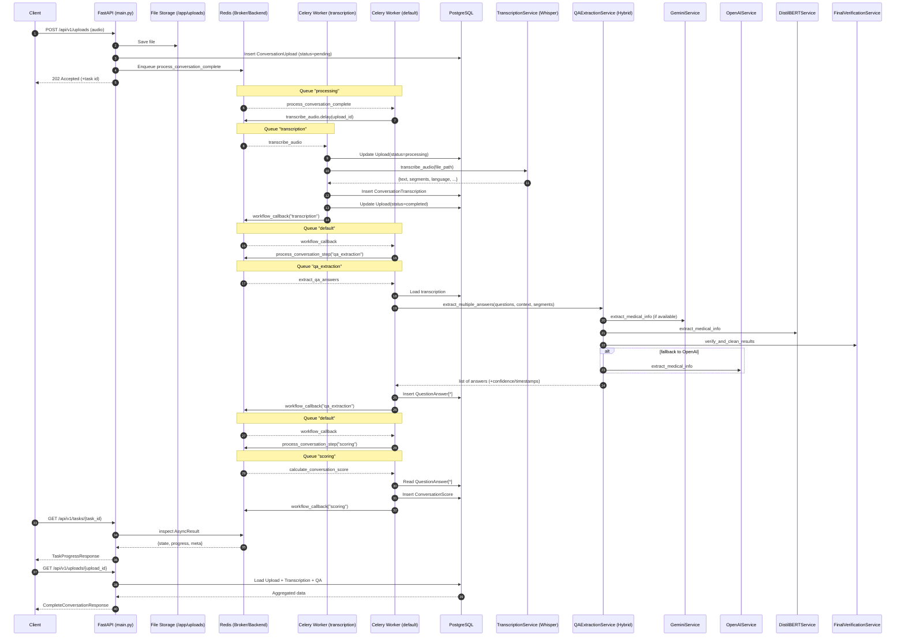
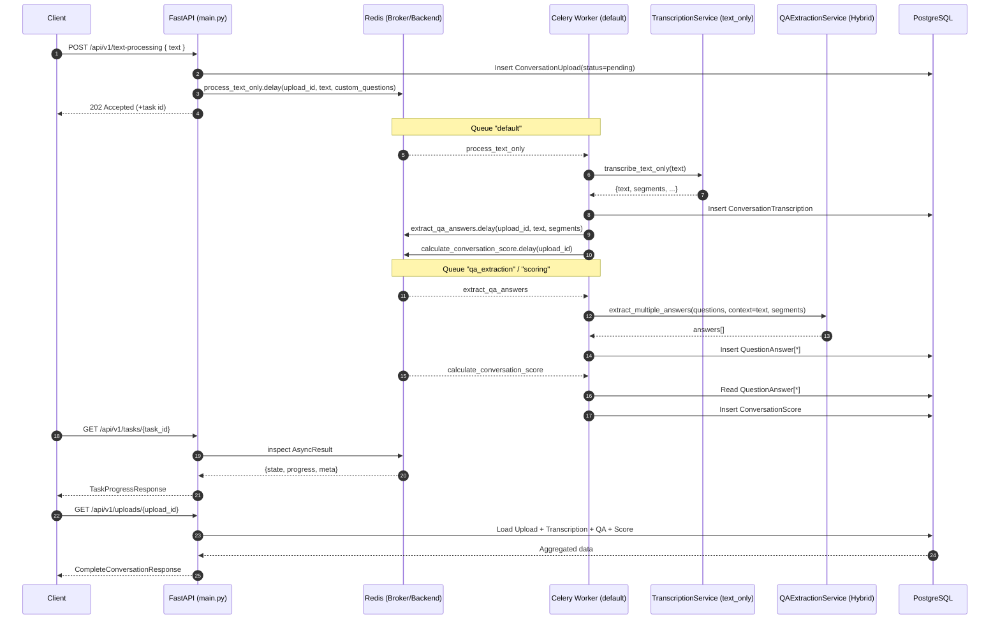
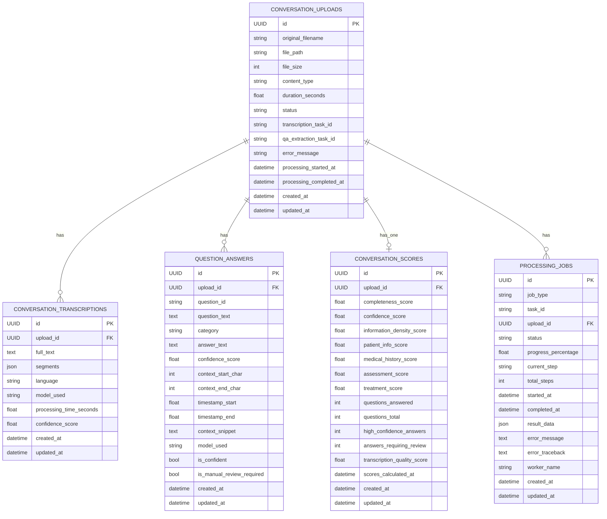

## System Architecture Overview

This document describes the end-to-end architecture for the Nurse Conversation Processing API, including core components, processing pipelines, and the data model. Diagrams are written in Mermaid so they render directly in most code hosts.

### Key Components
- **FastAPI (`main.py`)**: HTTP API for uploads, status, and results
- **Celery (`celery_app.py`, `tasks.py`)**: Background processing with queue routing and progress updates
- **Workers**: Dedicated queues for transcription, QA extraction, processing, and scoring
- **Services**: Transcription (Whisper), QA Extraction (Hybrid: Gemini + DistilBERT + Final Verification)
- **Data**: PostgreSQL for persistence, Redis as Celery broker/result backend, local `uploads/` and `logs/`

### Component Diagram

```mermaid
graph TD
  %% Nodes
  subgraph "Client"
    user["User / Integrator"]
  end

  subgraph "Edge / Proxy"
    nginx["Nginx (optional) :80 / :443"]
  end

  subgraph "Application Layer"
    api["FastAPI App :8000\nmain.py"]
    celery_api["Celery API & Config\ncelery_app.py"]
  end

  subgraph "Workers & Schedulers"
    worker_default["Celery Worker\nqueues: default, processing, qa_extraction, scoring"]
    worker_tx["Transcription Worker\nqueues: transcription, high_priority"]
    beat["Celery Beat\nperiodic: cleanup_failed_tasks, update_system_metrics"]
    flower["Flower UI :5555\nmonitoring"]
  end

  subgraph "Data & Storage"
    redis["Redis :6379\nBroker + Result Backend"]
    pg["PostgreSQL :5432\nconversation_* tables"]
    uploads["Uploads dir /app/uploads"]
    logs["Logs /app/logs"]
  end

  subgraph "Tasks"
    t_pipeline["process_conversation_complete\nqueue: processing"]
    t_tx["transcribe_audio\nqueue: transcription"]
    t_qa["extract_qa_answers\nqueue: qa_extraction"]
    t_score["calculate_conversation_score\nqueue: scoring"]
    t_step["process_conversation_step"]
    t_cb["workflow_callback"]
    t_cleanup["cleanup_failed_tasks (beat)"]
    t_metrics["update_system_metrics (beat)"]
  end

  subgraph "Services"
    svc_tx["TranscriptionService\nWhisper"]
    svc_qa["QAExtractionService\nHybrid: Gemini + DistilBERT + Verification"]
    svc_gemini["GeminiService"]
    svc_openai["OpenAIService"]
    svc_distil["DistilBERTService"]
    svc_verify["FinalVerificationService"]
  end

  %% Client to API
  user -->|"Upload audio / text"| nginx
  nginx --> api
  user -.->|"Direct (no proxy)"| api

  %% API interactions
  api -->|"Save file"| uploads
  api <--> |"CRUD"| pg
  api -->|"Enqueue Celery task (delay)"| t_pipeline
  api --> celery_api

  %% Task routing through broker
  t_pipeline -. "routes to 'processing'" .-> redis
  t_tx -. "routes to 'transcription'" .-> redis
  t_qa -. "routes to 'qa_extraction'" .-> redis
  t_score -. "routes to 'scoring'" .-> redis
  t_cleanup -. "routes to 'maintenance' (beat)" .-> redis
  t_metrics -. "routes to 'maintenance' (beat)" .-> redis

  %% Workers pull from broker
  worker_default <--> redis
  worker_tx <--> redis
  beat <--> redis
  flower <--> redis

  %% Workers execute tasks and hit services/DB
  worker_default --> t_pipeline
  worker_tx --> t_tx
  worker_default --> t_qa
  worker_default --> t_score
  worker_default --> t_step
  worker_default --> t_cb

  %% Task to services
  t_tx --> svc_tx
  t_qa --> svc_qa
  svc_qa --> svc_gemini
  svc_qa --> svc_openai
  svc_qa --> svc_distil
  svc_qa --> svc_verify

  %% Persist results
  t_tx -->|"write transcription"| pg
  t_qa -->|"write Q&A results"| pg
  t_score -->|"write score"| pg
  t_pipeline -->|"return task ids"| api

  %% Workflow progression
  t_tx --> t_cb --> t_step --> t_qa --> t_cb --> t_step --> t_score --> t_cb

  %% Observability
  api --> logs
  worker_default --> logs
  worker_tx --> logs
  beat --> logs
  flower --> logs

  %% User monitoring
  user -.->|"Flower UI :5555"| flower

  %% Task status polling
  user -->|"GET /api/v1/tasks/{task_id}"| api
  api <--> redis

  %% Results fetch
  user -->|"GET /api/v1/uploads/{upload_id}"| api
  api --> pg
```

Notes:
- The API writes uploads to `uploads/` and persists metadata/results to PostgreSQL.
- Celery routes different tasks to queues for isolation and scaling.
- Redis is both the broker and result backend for task state/progress.

## Audio Upload Pipeline (Sequence)

This sequence shows the asynchronous pipeline for audio files: upload → transcription → Q&A extraction → scoring.

## Text-only Pipeline (Sequence)

When text is provided (no audio), the system creates a synthetic transcription and proceeds with Q&A and scoring.

## Database ER Model

The ER diagram aligns with the SQLAlchemy models in `database_models.py` and the Pydantic schemas in `schemas.py`.

## Deployment & Ports
- **FastAPI**: `:8000` (see `docker-compose.yml` → service `ambientai_be_api`)
- **Flower**: `:5555` for task monitoring (`ambientai_be_flower`)
- **Redis**: `:6379` broker/result backend (`ambientai_be_redis`)
- **PostgreSQL**: `:5432` (`ambientai_be_postgres`)
- **Nginx (optional)**: `:80`, `:443` (`ambientai_be_nginx`)
- Dev extras: Adminer `:8080`, Redis Commander `:8081`, Jupyter `:8888` (see `docker-compose.dev.yml`)

## Task Routing (Queues)
- `tasks.transcribe_audio` → `transcription`
- `tasks.extract_qa_answers` → `qa_extraction`
- `tasks.process_conversation_complete` → `processing`
- `tasks.calculate_conversation_score` → `scoring`
- Periodic: `cleanup_failed_tasks`, `update_system_metrics` → `maintenance`

## How to read and update
- The diagrams reflect the code in `main.py`, `celery_app.py`, `tasks.py`, `database_models.py`, and `services/*`.
- Edit flows by updating tasks in `tasks.py` and their routes in `celery_app.py`.
- Add new entities in `database_models.py` and extend the ER diagram as needed.

---

**📐 Architecture designed by Soumyadeep**

*System architect and lead developer 

