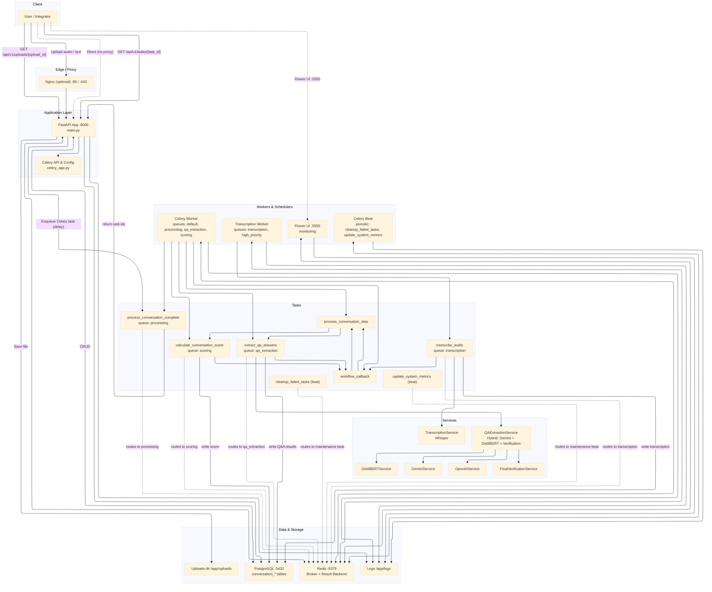

# Nurse Conversation Extract - Production Code Structure

## Overview
This project has been restructured for production use with modern AI service integration (Gemini, OpenAI) and improved architecture.

## System architecture
### Simple Left-Right Graph



## Directory Structure
```
nurse-conversation-extract/
├── services/                    # AI/ML service layer
│   ├── __init__.py            # Service package exports
│   ├── gemini_service.py      # Google Gemini AI integration
│   ├── openai_service.py      # OpenAI API integration
│   └── qa_service.py          # Unified QA service with fallback
├── config.py                   # Configuration management
├── main.py                     # FastAPI application
├── database.py                 # Database connection management
├── database_models.py          # SQLAlchemy models
├── schemas.py                  # Pydantic schemas
├── transcription.py            # Audio transcription service
├── qa_extraction.py            # Enhanced QA with AI services
├── tasks.py                    # Celery background tasks
├── celery_app.py               # Celery configuration
├── helpers.py                  # Utility functions
├── requirements.txt            # Python dependencies
├── docker-compose.yml          # Production services
├── docker-compose.dev.yml      # Development overrides
├── Dockerfile                  # Production image
├── Dockerfile.dev              # Development image
├── env.example                 # Environment variables template
└── PROJECT_STRUCTURE.md        # This file
```

## Key Features

### 1. Multi-Provider AI Integration
- **Google Gemini**: Primary AI service using Gemini 2.0 Flash
- **OpenAI**: Fallback service with GPT-4 support
- **Automatic Fallback**: Seamless switching between providers
- **Unified Interface**: Single service class for all AI operations

### 2. Robust Architecture
- **Service Layer**: Clean separation of concerns
- **Dependency Injection**: Proper configuration management
- **Error Handling**: Comprehensive error handling and logging
- **Async Support**: Full async/await support throughout

### 3. Enhanced Q&A Capabilities
- **Medical Information Extraction**: Specialized for healthcare conversations
- **Conversation Summarization**: AI-powered summaries
- **Fallback Mechanisms**: Traditional Hugging Face models as backup
- **Structured Output**: Consistent data formats

## API Endpoints

### Core Endpoints
- `POST /api/v1/conversations/upload` - Upload audio files
- `POST /api/v1/conversations/process` - Process conversations
- `GET /api/v1/tasks/{task_id}` - Check task status
- `GET /api/v1/conversations/{id}` - Get conversation details

### AI Testing Endpoints
- `POST /api/v1/test/gemini` - Test Gemini/OpenAI integration
- `POST /api/v1/test/medical-extraction` - Test medical info extraction

## Configuration

### Environment Variables
```bash
# Required
GEMINI_API_KEY=your_gemini_api_key
OPENAI_API_KEY=your_openai_api_key
DATABASE_URL=postgresql://...
REDIS_URL=redis://...
SECRET_KEY=your_secret_key

# Optional
DEBUG=false
LOG_LEVEL=INFO
WHISPER_MODEL=base
```

### AI Service Configuration
```python
# Gemini Settings
GEMINI_API_KEY=your_key
GEMINI_MODEL_NAME=gemini-2.0-flash
GEMINI_MAX_TOKENS=4096
GEMINI_TEMPERATURE=0.1

# OpenAI Settings
OPENAI_API_KEY=your_key
OPENAI_MODEL_NAME=gpt-4
OPENAI_MAX_TOKENS=4096
OPENAI_TEMPERATURE=0.1
```

## Usage Examples

### 1. Basic Gemini Integration
```python
from services.qa_service import QAService, AIProvider
from config import get_settings

settings = get_settings()
qa_service = QAService(
    gemini_settings=settings.gemini_settings,
    openai_settings=settings.openai_settings
)

# Generate content
result = await qa_service.generate_content(
    prompt="Explain medical terminology",
    provider=AIProvider.GEMINI
)
```

### 2. Medical Information Extraction
```python
# Extract medical info
extracted = await qa_service.extract_medical_info(
    conversation_text="Patient conversation...",
    questions=medical_questions,
    provider=AIProvider.GEMINI
)
```

### 3. Conversation Summarization
```python
# Generate summary
summary = await qa_service.summarize_conversation(
    conversation_text="Long conversation...",
    summary_type="medical"
)
```

## Docker Deployment

### Production
```bash
docker compose up -d
```

### Development
```bash
docker compose -f docker-compose.yml -f docker-compose.dev.yml up -d
```

### Environment Setup
1. Copy `env.example` to `.env`
2. Set your API keys and configuration
3. Update database URLs for your environment
4. Set appropriate secret keys

## Testing

### API Testing
```bash
# Test Gemini
curl -X POST "http://localhost:8000/api/v1/test/gemini" \
  -H "Content-Type: application/json" \
  -d '{"prompt": "Explain AI in simple terms", "provider": "gemini"}'

# Test Medical Extraction
curl -X POST "http://localhost:8000/api/v1/test/medical-extraction" \
  -H "Content-Type: application/json" \
  -d '{"conversation_text": "Sample medical conversation...", "provider": "gemini"}'
```

### Unit Testing
```bash
pytest tests/ -v
```

## Monitoring & Observability

### Celery Monitoring
- **Flower**: Web-based monitoring at `http://localhost:5555`
- **Redis Commander**: Redis management at `http://localhost:8081`
- **Adminer**: Database management at `http://localhost:8080`

### Logging
- Structured logging with Loguru
- Log rotation and retention policies
- Different log levels for development/production

## Security Considerations

### API Keys
- Store API keys in environment variables
- Never commit keys to version control
- Use different keys for development/production

### Database Security
- Use strong passwords
- Limit database access
- Enable SSL in production

### CORS Configuration
- Configure allowed origins appropriately
- Restrict access in production environments

## Performance Optimization

### Caching
- Redis for Celery results
- Database connection pooling
- Model caching for AI services

### Scaling
- Multiple Celery workers
- Load balancing with Nginx
- Horizontal scaling support

## Troubleshooting

### Common Issues
1. **API Key Errors**: Check environment variables
2. **Service Unavailable**: Verify Docker containers are running
3. **Database Connection**: Check PostgreSQL status and credentials
4. **Celery Issues**: Verify Redis connection and worker status

### Debug Mode
```bash
DEBUG=true LOG_LEVEL=DEBUG docker compose up
```

## Migration Guide

### From Previous Version
1. Update environment variables
2. Add new API keys
3. Restart services
4. Test new endpoints

### Database Changes
- No breaking changes to existing schema
- New tables may be added for enhanced features

## Support & Maintenance

### Updates
- Regular dependency updates
- Security patches
- Feature enhancements

### Monitoring
- Health check endpoints
- Performance metrics
- Error tracking

### Backup
- Database backups
- Configuration backups
- Log retention policies
