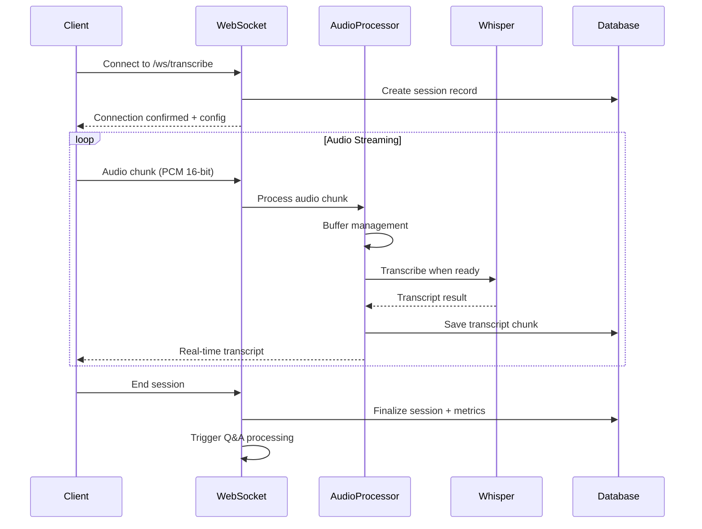

# WebSocket Real-Time Transcription Documentation

## Overview

This document describes the WebSocket-based real-time transcription system that has been integrated into the AmbientAI-BE project. This system allows for streaming audio transcription with immediate feedback, complementing the existing batch processing capabilities.

## Architecture

### Components Added

1. **WebSocket Transcription Service** (`websocket_transcription.py`)
   - `AudioChunkProcessor`: Processes streaming audio chunks
   - `WebSocketTranscriptionManager`: Manages WebSocket connections and sessions
   - Real-time audio buffering and processing
   - Session state management

2. **Database Models** (added to `database_models.py`)
   - `RealTimeSession`: Stores WebSocket session information
   - `RealTimeTranscriptChunk`: Stores individual transcript chunks
   - `RealTimeSessionMetrics`: Stores performance metrics

3. **WebSocket Endpoints** (added to `main.py`)
   - `/ws/transcribe`: Auto-generated session WebSocket endpoint
   - `/ws/transcribe/{session_id}`: Custom session ID WebSocket endpoint
   - `/api/v1/websocket/sessions`: Get active sessions
   - `/api/v1/websocket/sessions/{session_id}/end`: End a session
   - `/api/v1/websocket/broadcast`: Broadcast to all sessions

4. **Configuration** (added to `config.py`)
   - `WebSocketSettings`: Configuration for WebSocket parameters
   - Environment variables for tuning performance

5. **Schemas** (added to `schemas.py`)
   - WebSocket message schemas
   - Real-time session response schemas
   - Metrics and control message schemas

## How It Works

### 1. Connection Flow



### 2. Audio Processing Pipeline

1. **Audio Reception**: Raw PCM 16-bit audio at 16kHz, mono
2. **Buffering**: Accumulate audio chunks with configurable overlap
3. **Chunk Processing**: Process when buffer reaches minimum size (2 seconds default)
4. **Transcription**: Use Whisper (base model for speed) for real-time processing
5. **Response**: Send immediate transcript back to client
6. **Storage**: Save chunks and metrics to database

### 3. Session Management

- **Session Creation**: Automatic or custom session IDs
- **State Tracking**: Active connections, processing metrics, session data
- **Cleanup**: Automatic cleanup on disconnect or timeout
- **Metrics Collection**: Real-time performance tracking

## Configuration

### Environment Variables

```bash
# WebSocket Settings
WEBSOCKET_MAX_CONNECTIONS=100           # Maximum concurrent connections
WEBSOCKET_HEARTBEAT_INTERVAL=30         # Heartbeat interval (seconds)
WEBSOCKET_CHUNK_TIMEOUT=10              # Chunk processing timeout
WEBSOCKET_MAX_SESSION_DURATION=7200     # Maximum session duration (2 hours)
WEBSOCKET_AUDIO_BUFFER_SIZE=8192        # Audio buffer size (bytes)
WEBSOCKET_SAMPLE_RATE=16000             # Audio sample rate (Hz)
WEBSOCKET_CHANNELS=1                    # Audio channels (mono)
WEBSOCKET_CHUNK_DURATION=2.0            # Processing chunk duration (seconds)
WEBSOCKET_OVERLAP_DURATION=0.5          # Overlap between chunks (seconds)
WEBSOCKET_WHISPER_MODEL=base            # Whisper model for real-time processing
```

### Performance Tuning

- **Chunk Duration**: Shorter = lower latency, higher CPU usage
- **Overlap Duration**: Prevents word cutting at chunk boundaries
- **Whisper Model**: `tiny` for speed, `base` for balance, `small+` for accuracy
- **Buffer Size**: Larger = more stable processing, higher memory usage

## API Usage

### WebSocket Protocol

#### Connection
```javascript
// Auto-generated session ID
const ws = new WebSocket('ws://localhost:8000/ws/transcribe');

// Custom session ID
const ws = new WebSocket('ws://localhost:8000/ws/transcribe/my-session-123');
```

#### Sending Audio
```javascript
// Send binary audio data (PCM 16-bit, 16kHz, mono)
const audioChunk = new Int16Array(audioBuffer);
ws.send(audioChunk.buffer);
```

#### Control Messages
```javascript
// Ping
ws.send(JSON.stringify({ type: 'ping' }));

// Get session info
ws.send(JSON.stringify({ type: 'session_info' }));

// End session
ws.send(JSON.stringify({ type: 'end_session' }));
```

#### Receiving Messages
```javascript
ws.onmessage = (event) => {
    const data = JSON.parse(event.data);
    
    switch (data.type) {
        case 'connected':
            console.log('Connected:', data.session_id);
            break;
            
        case 'transcript':
            console.log('Transcript:', data.text);
            console.log('Confidence:', data.confidence);
            break;
            
        case 'error':
            console.error('Error:', data.message);
            break;
    }
};
```

### REST API Endpoints

#### Get Active Sessions
```bash
GET /api/v1/websocket/sessions
```

Response:
```json
{
    "active_sessions": 3,
    "max_connections": 100,
    "sessions": [
        {
            "session_id": "abc-123",
            "connected_at": "2024-01-15T10:00:00Z",
            "total_chunks": 45,
            "transcript_length": 1200
        }
    ]
}
```

#### End Session
```bash
POST /api/v1/websocket/sessions/{session_id}/end
```

#### Broadcast Message
```bash
POST /api/v1/websocket/broadcast
Content-Type: application/json

{
    "type": "announcement",
    "message": "System maintenance in 5 minutes"
}
```

## Frontend Integration

### Browser Audio Capture

```javascript
class AudioStreamer {
    async startRecording() {
        // Get microphone access
        const stream = await navigator.mediaDevices.getUserMedia({
            audio: {
                sampleRate: 16000,
                channelCount: 1,
                echoCancellation: true,
                noiseSuppression: true
            }
        });
        
        // Create audio context
        this.audioContext = new AudioContext({ sampleRate: 16000 });
        const source = this.audioContext.createMediaStreamSource(stream);
        
        // Use AudioWorklet for real-time processing
        await this.audioContext.audioWorklet.addModule('audio-processor.js');
        const processor = new AudioWorkletNode(this.audioContext, 'audio-processor');
        
        processor.port.onmessage = (event) => {
            // Send audio chunk to WebSocket
            this.ws.send(event.data);
        };
        
        source.connect(processor);
        processor.connect(this.audioContext.destination);
    }
}
```

### Audio Worklet Processor (`audio-processor.js`)

```javascript
class AudioProcessor extends AudioWorkletProcessor {
    constructor() {
        super();
        this.buffer = [];
        this.bufferSize = 8192; // ~0.5s at 16kHz
    }
    
    process(inputs, outputs, parameters) {
        const input = inputs[0];
        if (input.length > 0) {
            const channelData = input[0];
            
            // Convert float32 to int16
            for (let i = 0; i < channelData.length; i++) {
                const sample = Math.max(-1, Math.min(1, channelData[i]));
                this.buffer.push(Math.round(sample * 32767));
            }
            
            // Send when buffer is full
            if (this.buffer.length >= this.bufferSize) {
                const int16Array = new Int16Array(this.buffer.splice(0, this.bufferSize));
                this.port.postMessage(int16Array.buffer);
            }
        }
        
        return true;
    }
}

registerProcessor('audio-processor', AudioProcessor);
```

## Testing

### Test Client

A Python test client is provided (`websocket_test_client.py`):

```bash
# Basic test with synthetic audio
python websocket_test_client.py --duration 10

# Test with audio file
python websocket_test_client.py --audio-file conversation.wav

# Interactive mode
python websocket_test_client.py --interactive

# Custom session ID
python websocket_test_client.py --session-id my-test-session
```

### HTML Test Page

A complete HTML test page is provided (`websocket_test.html`):

- Real-time microphone recording
- WebSocket connection management
- Live transcript display
- Performance metrics
- Session control

Open in browser: `file:///path/to/websocket_test.html`

## Performance Considerations

### Latency Optimization

1. **Small Chunks**: Use 0.5-1 second chunks for lower latency
2. **Fast Model**: Use Whisper `tiny` or `base` for real-time processing
3. **Overlap**: Use 0.3-0.5 second overlap to prevent word cutting
4. **Preprocessing**: Minimal audio preprocessing for speed

### Resource Usage

- **CPU**: ~1 core per 4-8 concurrent sessions (with base model)
- **Memory**: ~100MB per session for audio buffering
- **Network**: ~32KB/s per session (16kHz, 16-bit audio)
- **Database**: ~1KB per transcript chunk

### Scaling

- **Horizontal**: Deploy multiple instances with load balancer
- **Redis Sessions**: Use Redis for session state in multi-instance setup
- **GPU**: Enable GPU acceleration for Whisper in high-load scenarios
- **CDN**: Use WebSocket-compatible CDN for global distribution

## Integration with Existing System

### Coexistence with Batch Processing

The WebSocket system complements the existing batch processing:

1. **Real-time**: Immediate transcription during conversation
2. **Batch**: Complete analysis with Q&A extraction after session ends
3. **Hybrid**: Real-time feedback + comprehensive post-processing

### Session Finalization

When a WebSocket session ends:

1. Full transcript is aggregated
2. A `ConversationUpload` record is created
3. Q&A extraction task is triggered
4. Results available via existing REST API

### Database Schema

New tables coexist with existing schema:

- `realtime_sessions`: WebSocket session metadata
- `realtime_transcript_chunks`: Individual transcript pieces
- `realtime_session_metrics`: Performance tracking
- Links to existing `conversation_uploads` for final processing

## Security Considerations

### Authentication

Currently implemented as open endpoints. For production:

```python
# Add authentication to WebSocket endpoints
@app.websocket("/ws/transcribe")
async def websocket_transcribe(
    websocket: WebSocket,
    token: str = Query(..., description="Authentication token")
):
    # Validate token
    user = authenticate_token(token)
    if not user:
        await websocket.close(code=1008, reason="Authentication failed")
        return
    
    # Continue with connection...
```

### Rate Limiting

```python
# Add rate limiting
from slowapi import Limiter
from slowapi.util import get_remote_address

limiter = Limiter(key_func=get_remote_address)

@app.websocket("/ws/transcribe")
@limiter.limit("10/minute")  # 10 connections per minute per IP
async def websocket_transcribe(websocket: WebSocket):
    # Connection logic...
```

### Data Privacy

- Audio chunks are processed in memory only
- Transcripts stored in database with session isolation
- Automatic cleanup of old sessions
- Optional encryption for sensitive data

## Troubleshooting

### Common Issues

1. **Connection Rejected**
   - Check max connections limit
   - Verify server is running
   - Check WebSocket URL format

2. **No Transcription Results**
   - Verify audio format (PCM 16-bit, 16kHz, mono)
   - Check chunk size (should be sufficient for processing)
   - Monitor server logs for Whisper errors

3. **High Latency**
   - Reduce chunk duration
   - Use faster Whisper model
   - Check network connectivity
   - Monitor server CPU usage

4. **Audio Quality Issues**
   - Check microphone permissions
   - Verify audio preprocessing
   - Monitor confidence scores
   - Adjust noise suppression settings

### Monitoring

Check these metrics for health:

- Active session count: `/api/v1/websocket/sessions`
- Processing times: Real-time metrics in session info
- Error rates: Server logs and error message frequency
- Resource usage: CPU, memory, network bandwidth

### Debug Mode

Enable debug logging:

```bash
LOG_LEVEL=DEBUG
```

This provides detailed logs of:
- WebSocket connection events
- Audio chunk processing
- Transcription results
- Error details

## Future Enhancements

### Planned Features

1. **Voice Activity Detection (VAD)**
   - Only process audio when speech is detected
   - Reduce processing load and improve efficiency

2. **Speaker Diarization**
   - Identify different speakers in real-time
   - Add speaker labels to transcript chunks

3. **Streaming Q&A**
   - Extract answers in real-time as conversation progresses
   - Immediate feedback on missing information

4. **Multi-language Support**
   - Auto-detect language changes
   - Support code-switching scenarios

5. **Advanced Audio Processing**
   - Background noise reduction
   - Audio quality enhancement
   - Echo cancellation

### Performance Improvements

1. **Streaming Whisper**
   - Implement true streaming Whisper for lower latency
   - Reduce memory usage with streaming processing

2. **Model Optimization**
   - Quantized models for faster inference
   - Custom models fine-tuned for medical conversations

3. **Caching**
   - Cache common audio patterns
   - Predict and pre-process likely continuations

## Conclusion

The WebSocket real-time transcription system provides immediate feedback during conversations while maintaining integration with the existing batch processing pipeline. It offers:

- **Low Latency**: Near real-time transcription results
- **Scalability**: Support for multiple concurrent sessions
- **Flexibility**: Configurable audio parameters and models
- **Integration**: Seamless connection to existing Q&A extraction
- **Monitoring**: Comprehensive metrics and session management

This enhancement makes the AmbientAI-BE system suitable for live conversation assistance while preserving the robust batch processing capabilities for comprehensive analysis.
